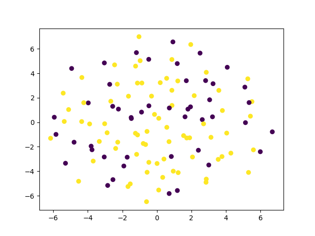
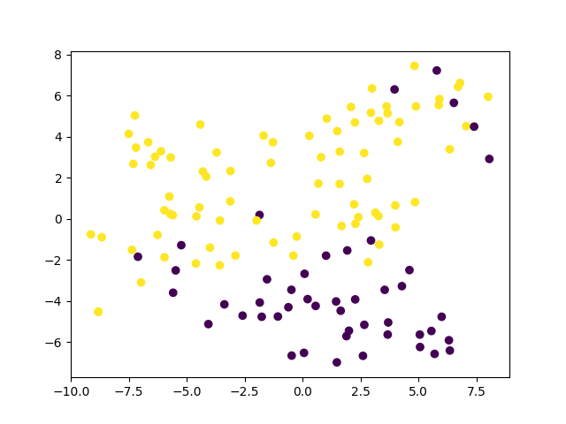
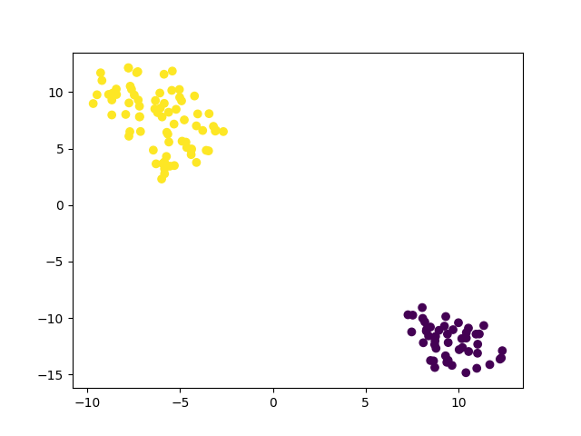

## ECG Analysis
* `data/scrape.py` - Downloads the entire PTB dataset.
* `data/patients.txt` - A list of all the records.
* `ecg_to_csv.py` - Converts a final list of ECGs into CSV files.
* `filter_align.py` - Filter and determine one period of the ECG signal.
* `separate.py` - Split the data into positive cases and negative cases.
* `tsne_plot.py` - Extract coefficents from the waveforms and plot the t-SNE output.
* `tsne.py` - A Python implementation of [t-SNE](https://lvdmaaten.github.io/tsne/), written by the original author.

## Requirements

`wfdb`, `scipy.signal`, `numpy`, `pylab`, `pywt`, `matplotlib`, `glob`

## Running the Project

* **Download Data** - In the `data` folder, run `scrape.py`. In the home directory, run `separate.py` to get the positive and negative cases.
* **Extract One Wave** - Run `filter_align.py` once for positive and once for negative cases.
* **Get Final CSV List** - Run `ecg_to_csv.py` to get a final list of CSV files.
* **t-SNE Plot** - Run `tsne_plot.py` to extract coefficients from CSV files and get a final 2D t-SNE plot. Follow instructions in code to generate 3D plots.

Random Data

Unaligned ECG Signals

Aligned ECG Signals

